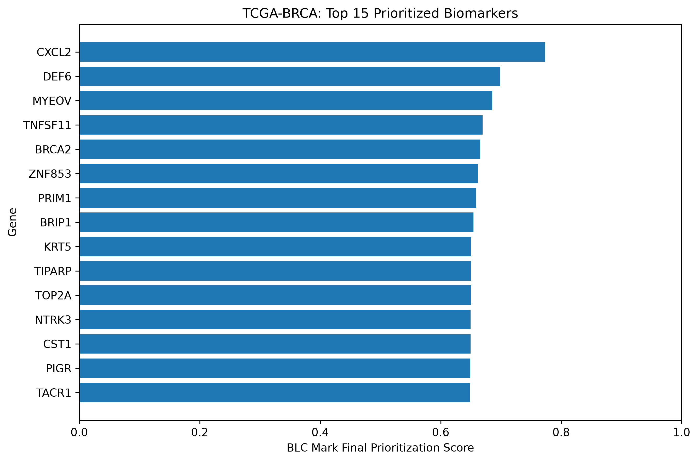
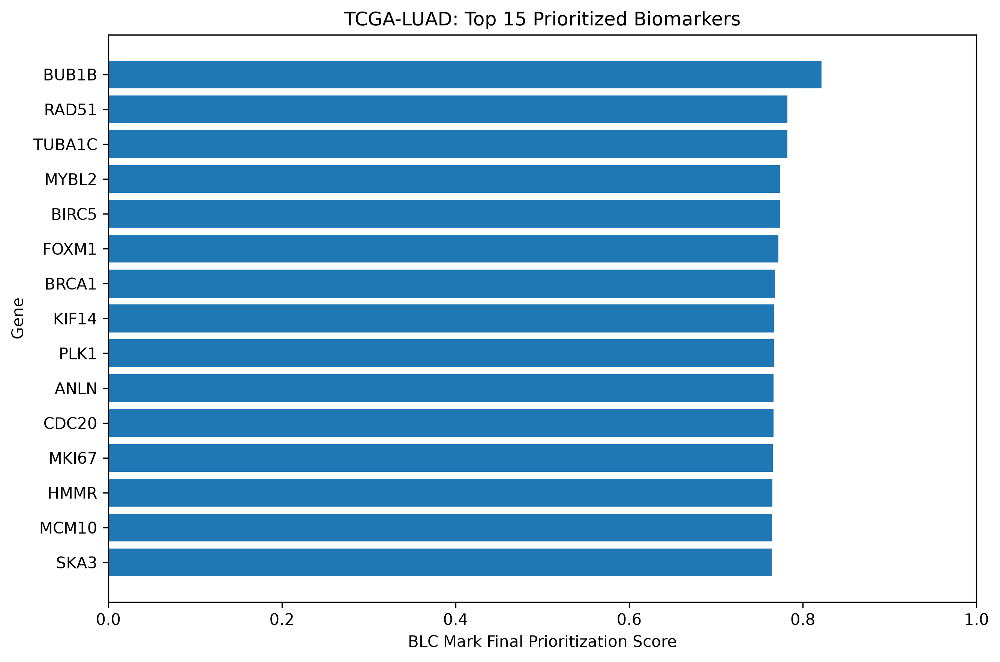
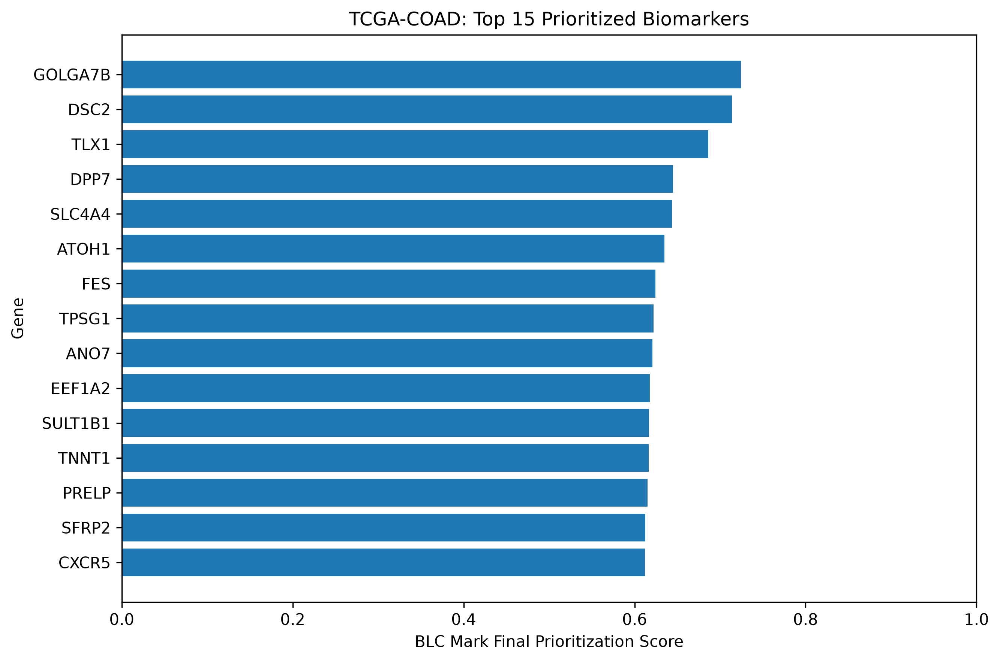
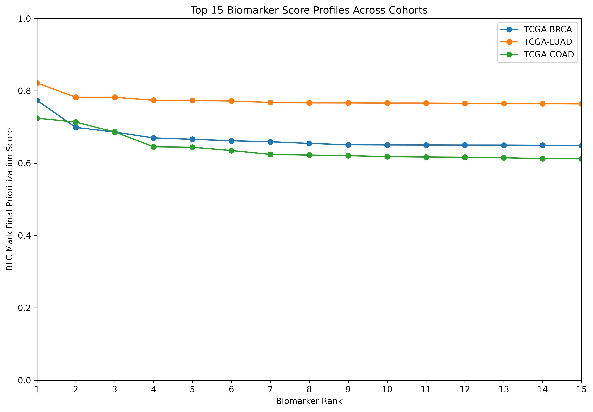

# BLC Mark V1 — Scientific Results Report

## Overview

BLC Mark V1 is a reproducible cancer biomarker discovery,
evidence-integration, and prioritization workflow applied to three
TCGA cancer cohorts:

- TCGA-BRCA — Breast Cancer
- TCGA-LUAD — Lung Adenocarcinoma
- TCGA-COAD — Colorectal Cancer

Version 1 uses RNA-seq gene-expression data only.

The implemented workflow consists of six phases:

1. Scientific & Engineering Foundation
2. Data Acquisition & Preparation
3. Biomarker Discovery
4. Evidence Integration
5. Biomarker Prioritization
6. Scientific Outputs & Reproducibility

Generated at: `2026-08-31T12:24:38.892193+00:00`

---

## Scientific Question

Can publicly available transcriptomic cancer datasets be integrated
into a transparent and reproducible evidence framework to systematically
prioritize candidate cancer biomarkers?

---

## Analysis Design

Differential-expression analysis compared Primary Tumor samples with
Solid Tissue Normal samples.

The implemented Version 1 differential-expression workflow used:

- normalized log2 expression data
- Welch's unequal-variance two-sample t-test
- Benjamini-Hochberg multiple-testing correction
- adjusted p-value significance threshold of 0.05
- no additional gene-expression filtering

Significant genes were passed to the evidence-integration phase.

Evidence categories used in prioritization included:

- differential-expression evidence
- cancer-association evidence
- clinical/prognostic evidence
- cross-cancer evidence
- functional and pathway context

The Version 1 prioritization model used four equally weighted scoring
components:

- differential-expression score: 0.25
- cancer-association score: 0.25
- clinical score: 0.25
- cross-cancer score: 0.25

A high final BLC Mark score indicates stronger prioritization under the
defined evidence framework. It does **not** constitute independent
clinical validation or proof of biomarker utility.

---

## Cohort Results

### TCGA-BRCA — Breast Cancer

- Significant differential-expression candidates: **16,644**
- Candidates retained for prioritization: **16,644**
- Candidates with complete final scores: **16,629**
- Candidates retained with unavailable final scores: **15**
- Highest-ranked candidate: **CXCL2**
- Highest final prioritization score: **0.7736**

| Rank | Gene | Effect size | Adjusted p-value | Clinical category | Cross-cancer cohorts | Pathways | Final score |
|---:|---|---:|---:|---|---:|---:|---:|
| 1 | CXCL2 | -4.5368 | 2.374e-86 | validated prognostic - favorable | 3 | 3 | 0.7736 |
| 2 | DEF6 | 0.8841 | 1.577e-15 | validated prognostic - favorable | 3 | 4 | 0.6990 |
| 3 | MYEOV | -3.2412 | 2.999e-38 | potential prognostic - favorable | 3 | 0 | 0.6857 |
| 4 | TNFSF11 | 0.8496 | 9.917e-04 | potential prognostic - favorable | 3 | 4 | 0.6695 |
| 5 | BRCA2 | 1.2951 | 2.045e-25 | unprognostic - unfavorable | 3 | 14 | 0.6658 |
| 6 | ZNF853 | -0.7599 | 5.358e-23 | validated prognostic - favorable | 3 | 0 | 0.6618 |
| 7 | PRIM1 | 0.5593 | 2.606e-22 | potential prognostic - unfavorable | 3 | 9 | 0.6590 |
| 8 | BRIP1 | 1.8414 | 1.418e-34 | unprognostic - unfavorable | 3 | 15 | 0.6545 |
| 9 | KRT5 | -3.7934 | 1.167e-24 | potential prognostic - favorable | 3 | 7 | 0.6507 |
| 10 | TIPARP | -1.2664 | 9.541e-31 | potential prognostic - favorable | 3 | 0 | 0.6503 |

### TCGA-LUAD — Lung Adenocarcinoma

- Significant differential-expression candidates: **16,031**
- Candidates retained for prioritization: **16,031**
- Candidates with complete final scores: **16,018**
- Candidates retained with unavailable final scores: **13**
- Highest-ranked candidate: **BUB1B**
- Highest final prioritization score: **0.8215**

| Rank | Gene | Effect size | Adjusted p-value | Clinical category | Cross-cancer cohorts | Pathways | Final score |
|---:|---|---:|---:|---|---:|---:|---:|
| 1 | BUB1B | 3.5485 | 1.009e-42 | validated prognostic - unfavorable | 3 | 10 | 0.8215 |
| 2 | RAD51 | 2.2457 | 2.840e-37 | validated prognostic - unfavorable | 3 | 13 | 0.7822 |
| 3 | TUBA1C | 1.1123 | 2.378e-21 | validated prognostic - unfavorable | 3 | 32 | 0.7821 |
| 4 | MYBL2 | 3.9457 | 2.220e-39 | validated prognostic - unfavorable | 3 | 3 | 0.7738 |
| 5 | BIRC5 | 3.8086 | 7.231e-36 | validated prognostic - unfavorable | 3 | 10 | 0.7735 |
| 6 | FOXM1 | 3.2068 | 1.848e-45 | validated prognostic - unfavorable | 3 | 3 | 0.7717 |
| 7 | BRCA1 | 1.2221 | 2.910e-39 | validated prognostic - unfavorable | 3 | 28 | 0.7679 |
| 8 | KIF14 | 3.5289 | 5.339e-50 | validated prognostic - unfavorable | 3 | 3 | 0.7667 |
| 9 | PLK1 | 3.2776 | 2.619e-45 | validated prognostic - unfavorable | 3 | 25 | 0.7666 |
| 10 | ANLN | 3.5619 | 1.158e-48 | validated prognostic - unfavorable | 3 | 3 | 0.7661 |

### TCGA-COAD — Colorectal Cancer

- Significant differential-expression candidates: **15,468**
- Candidates retained for prioritization: **15,468**
- Candidates with complete final scores: **15,457**
- Candidates retained with unavailable final scores: **11**
- Highest-ranked candidate: **GOLGA7B**
- Highest final prioritization score: **0.7244**

| Rank | Gene | Effect size | Adjusted p-value | Clinical category | Cross-cancer cohorts | Pathways | Final score |
|---:|---|---:|---:|---|---:|---:|---:|
| 1 | GOLGA7B | 2.0296 | 7.190e-32 | validated prognostic - unfavorable | 3 | 0 | 0.7244 |
| 2 | DSC2 | -1.6409 | 7.110e-19 | validated prognostic - favorable | 3 | 2 | 0.7138 |
| 3 | TLX1 | 3.1792 | 3.359e-27 | potential prognostic - unfavorable | 3 | 0 | 0.6861 |
| 4 | DPP7 | 0.7396 | 1.928e-13 | validated prognostic - unfavorable | 3 | 1 | 0.6451 |
| 5 | SLC4A4 | -6.2335 | 2.465e-73 | potential prognostic - favorable | 3 | 3 | 0.6438 |
| 6 | ATOH1 | -3.0694 | 3.446e-30 | potential prognostic - favorable | 3 | 0 | 0.6348 |
| 7 | FES | -1.0878 | 4.005e-24 | potential prognostic - unfavorable | 3 | 4 | 0.6241 |
| 8 | TPSG1 | -4.0105 | 4.035e-41 | potential prognostic - favorable | 3 | 0 | 0.6223 |
| 9 | ANO7 | -2.1616 | 2.571e-20 | potential prognostic - favorable | 3 | 2 | 0.6209 |
| 10 | EEF1A2 | -2.9735 | 3.016e-23 | potential prognostic - unfavorable | 3 | 1 | 0.6179 |

---

## Cross-Cohort Prioritization

The cross-cohort figure compares the final prioritization-score profiles
of the fifteen highest-ranked candidates in each cohort. Scores are
interpreted within the BLC Mark Version 1 prioritization framework and
should not be interpreted as clinical effect sizes or probabilities.

---

## Interpretation

The three cohorts produced distinct prioritized biomarker profiles.

TCGA-BRCA contained a mixture of validated, potential, favorable,
unfavorable, and unprognostic evidence categories among its highest-ranked
candidates.

TCGA-LUAD showed a particularly strong concentration of candidates
classified by the integrated evidence layer as validated prognostic and
unfavorable among the highest-ranked results.

TCGA-COAD produced a more heterogeneous top-ranked profile containing
both favorable and unfavorable prognostic evidence categories.

These observations describe the evidence classifications captured by
the BLC Mark workflow. They do not establish causal roles, diagnostic
performance, treatment response, or prospective clinical validity.

---

## Missing and Unavailable Evidence

BLC Mark distinguishes unavailable evidence from negative evidence.

Candidates lacking sufficient evidence to calculate every required
scoring component are retained rather than silently discarded.
Their final score and rank remain unavailable instead of being replaced
with zero.

This distinction preserves traceability between:

- absence of supporting evidence,
- evidence explicitly representing no support, and
- evidence that could not be resolved or retrieved.

---

## Reproducibility and Traceability

BLC Mark preserves machine-readable outputs for each analytical stage,
including:

- differential-expression results
- analysis metadata
- QC reports
- integrated evidence records
- prioritization results
- final summary tables
- scientific figures

Phase-specific metadata records analysis configuration, cohort identity,
software or scoring versions, and relevant upstream file paths.

The Phase 6 tables and figures are generated programmatically from
the frozen Phase 5 outputs rather than being manually reconstructed.

---

## Limitations

Version 1 has several important limitations.

First, the analysis is restricted to RNA-seq gene-expression data and
does not integrate genomic variants, methylation, proteomics, or other
omics layers.

Second, differential expression was evaluated using the implemented
Welch t-test workflow on normalized log2 expression data rather than a
raw-count negative-binomial model.

Third, external evidence availability is not uniform across genes.
Some candidate identifiers could not be resolved, and some candidates
therefore remain without complete final scores.

Fourth, prioritization reflects the predefined BLC Mark scoring system
and its Version 1 equal-weight configuration. Rankings should therefore
be interpreted as transparent computational prioritization, not as
clinical validation.

Finally, the analyzed Version 1 release contains three cohorts:
TCGA-BRCA, TCGA-LUAD, and TCGA-COAD.

---

## Conclusion

BLC Mark V1 demonstrates an end-to-end, reproducible workflow for
transcriptomic cancer biomarker discovery, external evidence integration,
and transparent candidate prioritization across three TCGA cancer
cohorts.

The system retains significant candidates through the evidence and
ranking stages, explicitly represents unavailable evidence, and produces
auditable machine-readable outputs alongside researcher-facing tables
and figures.

The resulting ranked candidates provide hypotheses for further
biological investigation and independent experimental or clinical
validation rather than definitive clinical biomarkers.
